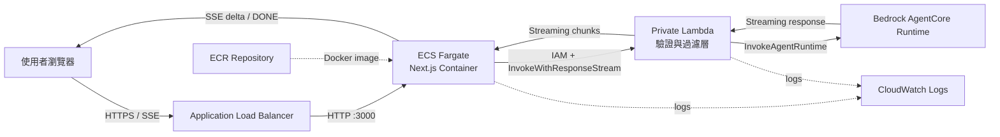

# AWS ECS Fargate → Lambda → AgentCore 部署流程

本文件說明如何將此 Next.js 前端部署到 Amazon ECS Fargate，並由 ECS 上的 Next.js 伺服器端私下呼叫 Lambda 過濾層，再由 Lambda 呼叫 Amazon Bedrock AgentCore Runtime。瀏覽器不直接接觸 Lambda、AgentCore、AWS 憑證或真正的後端端點。

## 1. 目標架構



實際請求路徑：

```text
Browser
  → ALB
  → ECS Fargate（Next.js /api/chat/stream）
  → Lambda（私有 IAM 呼叫）
  → AgentCore Runtime
```

串流回傳路徑：

```text
AgentCore → Lambda → ECS Next.js → ALB → Browser
```

### 此架構刻意不使用的項目

- 瀏覽器不直接呼叫 AgentCore。
- 瀏覽器不直接呼叫 Lambda。
- Lambda 不需要公開 Function URL。
- 預設不需要 API Gateway；ECS 使用 AWS SDK 與 Task Role 私下呼叫 Lambda。
- 不把 AWS Access Key、Secret Key 或 AgentCore 憑證放進前端、Docker image 或 `.env`。

如果未來有瀏覽器、行動 App 或第三方系統需要直接存取 Lambda，才考慮在 Lambda 前增加 API Gateway。

## 2. 區域選擇

本專案統一使用：

```text
Asia Pacific (Tokyo): ap-northeast-1
```

在 AWS Console 右上角先將「亞太地區（台北）」切換成「亞太地區（東京）」。ECS、ECR、Lambda、CloudWatch、IAM policy 中的 AgentCore ARN 與 AgentCore Runtime 應使用一致且受支援的區域。

> 不要在台北區域建立一半資源、再到東京建立另一半；跨區會增加設定複雜度、延遲與權限問題。

## 3. 部署前需要確認的資料

向 AgentCore／Agent 團隊取得：

- AWS Region：預期為 `ap-northeast-1`
- AgentCore Runtime ARN
- AgentCore qualifier（沒有則使用預設 endpoint）
- InvokeAgentRuntime payload JSON 格式
- 串流 response 範例與 `contentType`
- 是否由 AgentCore 使用 `runtimeSessionId` 維持多輪上下文
- 錯誤格式與預期逾時

建議的前端與 Lambda API contract：

```json
{
  "message": "請分析 BTC",
  "sessionId": "550e8400-e29b-41d4-a716-446655440000"
}
```

規則：

- `message` 必須是非空字串，並限制最大長度。
- `sessionId` 使用 `crypto.randomUUID()` 產生。
- 同一段對話沿用相同 `sessionId`。
- New Chat 產生新的 `sessionId`。
- UUID 為 36 字元，符合 AgentCore Runtime session ID 的輸入長度需求。
- Lambda 不接受前端提供任意 backend URL、AgentCore ARN、AWS Region 或 user ID。

前端目前期待的 SSE 格式：

```text
data: {"delta":"BTC "}

data: {"delta":"目前市場情緒..."}

data: [DONE]

```

## 4. 需要建立的 AWS 資源

| 資源 | 用途 |
|---|---|
| ECR Repository | 儲存 Next.js Docker image |
| ECS Cluster | 管理 Fargate service |
| ECS Task Definition | 定義 image、port、CPU、memory、roles 與環境變數 |
| ECS Fargate Service | 維持前端 container 運作並進行 rolling deployment |
| Application Load Balancer | 對外提供 HTTP／HTTPS 與 SSE |
| ALB Target Group | 將請求送到 ECS task 的 port 3000 |
| ECS Task Execution Role | 從 ECR 拉 image、寫入 CloudWatch Logs |
| ECS Task Role | 只允許 Next.js 呼叫指定 Lambda |
| Lambda Function | 驗證、過濾、轉換並呼叫 AgentCore |
| Lambda Execution Role | 寫 log 並呼叫指定 AgentCore Runtime |
| CloudWatch Log Groups | 保存 ECS 與 Lambda 日誌 |
| ACM Certificate（正式環境） | HTTPS 憑證 |
| Route 53（選用） | 自訂網域 DNS |

## 5. 建議部署順序

為了將問題分層，依照以下順序部署：

1. 切換 AWS Console 到東京 `ap-northeast-1`。
2. 建立 ECR Repository。
3. 建立回傳 mock SSE 的 Lambda，暫時不接 AgentCore。
4. 建立 IAM Roles，讓 ECS 只能呼叫這個 Lambda。
5. 建置並推送前端 Docker image 到 ECR。
6. 建立 ECS Cluster、Task Definition、Service 與 ALB。
7. 驗證 Browser → ALB → ECS → mock Lambda 的 SSE。
8. 取得 AgentCore ARN 與 payload contract。
9. 為 Lambda Role 加入最小 AgentCore 權限。
10. 將 Lambda mock 改成 InvokeAgentRuntime 串流轉接。
11. 驗證相同 session 的多輪對話、New Chat、取消與錯誤處理。
12. 綁定網域與 HTTPS，最後再開放正式流量。

## 6. 從 AWS Console 建立 ECR

1. 確認右上角為「亞太地區（東京）」。
2. 搜尋 `Elastic Container Registry`。
3. 進入 `Repositories` → `Create repository`。
4. 選擇 `Private`。
5. Repository name：

   ```text
   hoya-bit-frontend
   ```

6. 建議開啟 image scan 或建立後再配置 enhanced scanning。
7. 建立完成後記錄 repository URI：

   ```text
   <ACCOUNT_ID>.dkr.ecr.ap-northeast-1.amazonaws.com/hoya-bit-frontend
   ```

### 建置 image 的選擇

- **GitHub + CodeBuild**：適合不想在本機設定 AWS CLI；CodeBuild 從 GitHub 取得原始碼、建置並推送 ECR。
- **本機 Docker + AWS CLI**：最快，但本機必須完成 AWS SSO 登入。
- 不要將 AWS credentials 寫進 Dockerfile 或 repository。

## 7. 建立 IAM Roles

### 7.1 ECS Task Execution Role

用途：ECS/Fargate 拉取 ECR image 並寫 CloudWatch Logs。

Trust principal：

```text
ecs-tasks.amazonaws.com
```

附加 AWS managed policy：

```text
service-role/AmazonECSTaskExecutionRolePolicy
```

此 Role 不應取得 AgentCore 或 Lambda 業務權限。

### 7.2 ECS Task Role

用途：Next.js 的 server-side route 私下呼叫指定 Lambda。

最小權限範例：

```json
{
  "Version": "2012-10-17",
  "Statement": [
    {
      "Sid": "InvokeChatFilterLambda",
      "Effect": "Allow",
      "Action": [
        "lambda:InvokeFunction"
      ],
      "Resource": "arn:aws:lambda:ap-northeast-1:<ACCOUNT_ID>:function:hoya-bit-agent-filter"
    }
  ]
}
```

Trust principal 同樣是：

```text
ecs-tasks.amazonaws.com
```

不要使用：

```json
"Resource": "*"
```

### 7.3 Lambda Execution Role

用途：Lambda 寫 CloudWatch Logs 並呼叫指定 AgentCore Runtime。

先附加基本日誌權限：

```text
service-role/AWSLambdaBasicExecutionRole
```

再加入最小 AgentCore 權限：

```json
{
  "Version": "2012-10-17",
  "Statement": [
    {
      "Sid": "InvokeAgentCoreRuntime",
      "Effect": "Allow",
      "Action": [
        "bedrock-agentcore:InvokeAgentRuntime"
      ],
      "Resource": "<AGENTCORE_RUNTIME_ARN>"
    }
  ]
}
```

只有在 Lambda 代表指定 user ID 呼叫 AgentCore 時，才另外評估：

```text
bedrock-agentcore:InvokeAgentRuntimeForUser
```

user ID 必須由可信任的登入 claims 推導，不能直接相信 request body 的 `userId`。

## 8. 建立 Lambda 過濾層

建議設定：

```text
Function name: hoya-bit-agent-filter
Runtime: Node.js 22.x
Architecture: arm64（依 dependency 相容性調整）
Memory: 512 MB 起
Timeout: 60–300 秒，依 Agent 實際回應時間調整
```

Lambda 環境變數：

```text
AWS_AGENTCORE_REGION=ap-northeast-1
AGENTCORE_RUNTIME_ARN=<AGENTCORE_RUNTIME_ARN>
AGENTCORE_QUALIFIER=<OPTIONAL_QUALIFIER>
MAX_MESSAGE_LENGTH=10000
```

ARN 不是密碼，但不應由瀏覽器提供。真正的 API secret 或 token 應存放於 Secrets Manager 或 SSM Parameter Store，而不是明文環境變數或 Git。

### Lambda 必須負責

1. 解析 ECS 傳入的 payload。
2. 只允許 `message`、`sessionId` 與經核准的欄位。
3. 驗證型別、長度與格式。
4. 拒絕任意 URL、ARN、Region、Role ARN 與 header 注入。
5. 將 `sessionId` 映射為 AgentCore `runtimeSessionId`。
6. 將 payload 轉成 AgentCore 團隊定義的格式。
7. 呼叫 `InvokeAgentRuntime`。
8. 逐段轉送 AgentCore response，而不是等待完整答案。
9. 將內部錯誤映射為安全、穩定的錯誤碼。
10. 日誌中不記錄 token、完整使用者輸入或敏感資料。

### Lambda 不應負責

- 接受使用者指定的 backend URL。
- 接受使用者指定 AgentCore Runtime ARN。
- 將 AWS 錯誤堆疊原樣回傳瀏覽器。
- 使用硬編碼 Access Key 或 Secret Key。
- 無限制記錄完整 prompt、response 或 JWT。

## 9. 調整 Next.js ECS 呼叫方式

瀏覽器仍呼叫同源：

```text
POST /api/chat/stream
```

Next.js Route Handler 在 ECS server runtime 中：

1. 接收 `{ message, sessionId }`。
2. 使用 ECS Task Role 的短期憑證。
3. 使用 AWS SDK `InvokeWithResponseStream` 呼叫 Lambda。
4. 將 Lambda chunks 轉為目前 UI 需要的 SSE：

   ```text
   data: {"delta":"..."}\n\n
   ```

5. 完成時送出：

   ```text
   data: [DONE]\n\n
   ```

ECS Task 環境變數建議為：

```text
AWS_REGION=ap-northeast-1
CHAT_FILTER_LAMBDA_NAME=hoya-bit-agent-filter
```

不要再讓瀏覽器或 client-side bundle 取得 Lambda ARN。這些變數不要加 `NEXT_PUBLIC_`。

## 10. 建立 ECS Task Definition

建議初始設定：

```text
Launch type: AWS Fargate
Operating system: Linux
CPU architecture: ARM64 或 X86_64（必須與 image 一致）
CPU: 0.5 vCPU
Memory: 1 GB
Container port: 3000/TCP
```

Container 必須使用：

```text
PORT=3000
HOSTNAME=0.0.0.0
```

此專案的 Dockerfile 已設定上述兩項，並使用 Next.js standalone server。

設定：

- Execution role：ECS Task Execution Role
- Task role：只能呼叫指定 Lambda 的 ECS Task Role
- Log driver：`awslogs`
- Log group：例如 `/ecs/hoya-bit-frontend`
- Region：`ap-northeast-1`
- Stream prefix：`ecs`

不要把 secret 直接寫在 Task Definition；使用 Secrets Manager 或 SSM 注入。

## 11. 建立網路、ALB 與 ECS Service

### Development／PoC

可將 Fargate tasks 放在 public subnets 並啟用 public IP，但 Task Security Group 仍只允許 ALB 進入 port 3000。不要對 `0.0.0.0/0` 開放 task port 3000。

### Production

建議：

- ALB 位於至少兩個 public subnets。
- ECS tasks 位於至少兩個 private subnets。
- 使用 NAT Gateway 或必要的 VPC endpoints 存取 ECR、CloudWatch、Lambda 等 AWS 服務。
- ECS Service desired count 至少為 2。

### Security Groups

ALB Security Group：

```text
Inbound 80  from 0.0.0.0/0（僅初期測試）
Inbound 443 from 0.0.0.0/0（正式）
Outbound to ECS Security Group port 3000
```

ECS Security Group：

```text
Inbound 3000 only from ALB Security Group
Outbound 443 as required for AWS service calls
```

### Target Group

```text
Target type: IP
Protocol: HTTP
Port: 3000
Health check path: /
Success codes: 200-399
```

### ALB Listener

初期：

```text
HTTP :80 → ECS Target Group
```

正式：

```text
HTTP :80 → Redirect HTTPS :443
HTTPS :443 → ECS Target Group
```

ALB idle timeout 建議先設為：

```text
300 seconds
```

這可降低 Agent 長回覆途中 SSE 被 ALB 提前中斷的機率；仍需依實際最長回應時間調整。

## 12. 外部網址與 IP

部署完成後，ALB 會提供類似：

```text
http://hoya-bit-frontend-123456.ap-northeast-1.elb.amazonaws.com
```

ECS task 的 IP 會隨部署或重啟改變，不應直接使用。ALB 主要提供 DNS 名稱，不保證固定公開 IP。

正式環境建議：

```text
Route 53 domain → ALB alias record
ACM certificate → ALB HTTPS listener
```

如果業務明確要求固定入口 IP，再評估 AWS Global Accelerator；一般 Web 前端使用 ALB DNS／自訂網域即可。

## 13. 端到端驗證

### 13.1 ECS 與 ALB

開啟：

```text
http://<ALB_DNS_NAME>/
http://<ALB_DNS_NAME>/chat
```

確認：

- ECS Service desired count 與 running count 相同。
- Target Group targets 為 healthy。
- 首頁與聊天頁正常顯示。
- CloudWatch 有 ECS container 啟動 log。

### 13.2 SSE

使用：

```bash
curl -N \
  -X POST \
  "http://<ALB_DNS_NAME>/api/chat/stream" \
  -H "Content-Type: application/json" \
  -d '{"message":"請分析 BTC","sessionId":"550e8400-e29b-41d4-a716-446655440000"}'
```

預期逐段出現，而不是完成後一次出現：

```text
data: {"delta":"..."}

data: [DONE]
```

### 13.3 Session

1. 用 `SESSION-A` 告訴 Agent 一個資訊。
2. 再用同一 `SESSION-A` 詢問該資訊，確認上下文存在。
3. 換成 `SESSION-B`，確認不會繼承 `SESSION-A`。
4. 確認不同登入使用者不能任意使用他人的 session ID。

### 13.4 錯誤與取消

驗證：

- 空白 message → 400 類型錯誤。
- 過長 message → 明確拒絕。
- 無效 sessionId → 明確拒絕。
- Lambda AccessDenied → ECS 顯示安全錯誤，不洩漏 ARN／stack trace。
- AgentCore timeout／throttling → Lambda 正確結束 stream。
- 使用者按 Stop → Browser AbortSignal 中止 ECS response。
- ECS deployment／task replacement 時舊連線的行為符合預期。

## 14. CloudWatch 與排錯

需要查看：

```text
CloudWatch Logs → /ecs/hoya-bit-frontend
CloudWatch Logs → /aws/lambda/hoya-bit-agent-filter
ECS → Service → Events
EC2 → Target Groups → Targets
CloudTrail → Lambda Invoke / AgentCore Invoke events
```

常見問題：

| 症狀 | 可能原因 |
|---|---|
| ALB 503 | ECS target unhealthy、port 或 Security Group 錯誤 |
| ECS task 無法啟動 | ECR image、Execution Role、CPU architecture 或 log 設定錯誤 |
| Lambda AccessDenied | ECS Task Role 缺少指定 Lambda 的 `lambda:InvokeFunction` |
| AgentCore AccessDenied | Lambda Role 缺少 `bedrock-agentcore:InvokeAgentRuntime` |
| AgentCore ResourceNotFound | Runtime ARN、Region 或 qualifier 錯誤 |
| 畫面最後一次出現全部文字 | 中間層 buffering 或沒有逐段轉送 response |
| 對話失憶 | 每次請求使用不同 session ID |
| 不同使用者共享上下文 | session 沒有綁定已驗證的 user identity |
| SSE 中途斷線 | ALB idle timeout、Lambda timeout 或上游逾時太短 |

## 15. 安全檢查清單

- [ ] Browser 只連 ALB／自訂網域。
- [ ] Lambda 沒有公開 Function URL。
- [ ] ECS Task Role 只能 Invoke 指定 Lambda。
- [ ] Lambda Role 只能 Invoke 指定 AgentCore Runtime。
- [ ] ECS container port 3000 只允許 ALB Security Group。
- [ ] AWS credentials 未寫入 repository、Docker image 或環境變數。
- [ ] Secrets 使用 Secrets Manager／SSM。
- [ ] Request 有欄位 allowlist、型別、長度與 session 驗證。
- [ ] CloudWatch 不記錄 token 或敏感完整 payload。
- [ ] Production 使用 HTTPS。
- [ ] ALB、ECR、ECS、Lambda 與 AgentCore 位於規劃的區域。
- [ ] IAM policy 未使用不必要的 wildcard resource。

## 16. 上線與回滾

### 上線

1. 建置新的 immutable image tag，例如 Git commit SHA。
2. 推送 image 到 ECR。
3. 建立新的 ECS Task Definition revision。
4. 更新 ECS Service。
5. 等待新 targets healthy。
6. 驗證首頁、聊天、SSE 與 AgentCore session。
7. 再將舊 tasks drain／停止。

不要只使用無法追蹤內容的 `latest` 作為正式部署依據。

### 回滾

1. 在 ECS Service 選擇上一版 Task Definition revision。
2. Force new deployment。
3. 確認上一版 targets healthy。
4. 若問題在 Lambda，將 Lambda alias 切回上一版 version。
5. 透過 CloudWatch／CloudTrail 記錄定位失敗原因。

## 17. 成本與清理

可能持續產生費用的項目：

- ECS Fargate task CPU／memory 執行時間
- Application Load Balancer
- NAT Gateway（若使用）
- CloudWatch Logs 儲存與查詢
- ECR image storage
- Lambda invocation／duration
- AgentCore 與底層模型使用量
- Global Accelerator（若使用）

PoC 結束時至少檢查並刪除：

- ECS Service／Cluster
- ALB、listeners、target groups
- 不再使用的 ECR images／repository
- Lambda function 與 log groups
- NAT Gateway／Elastic IP
- 不再需要的 IAM roles／policies

## 18. 部署完成判定

只有以下條件都成立，才算完成：

- [ ] ECS Service running count 符合 desired count。
- [ ] ALB Target Group 全部 healthy。
- [ ] 公開網址可載入首頁與 `/chat`。
- [ ] `/api/chat/stream` 逐段輸出 SSE。
- [ ] ECS 使用 Task Role 成功呼叫 Lambda。
- [ ] Lambda 成功驗證並過濾 request。
- [ ] Lambda 使用自己的 Role 成功呼叫 AgentCore。
- [ ] 相同 session 可延續上下文；New Chat 不共享上下文。
- [ ] Stop、timeout、throttling、403 與 5xx 有可預期行為。
- [ ] CloudWatch 可追蹤請求，但不洩漏敏感資料。
- [ ] Production 已使用 HTTPS 與自訂網域（如有需求）。

## 19. 官方參考

- [Amazon ECS on AWS Fargate](https://docs.aws.amazon.com/AmazonECS/latest/developerguide/AWS_Fargate.html)
- [ECS Fargate supported Regions](https://docs.aws.amazon.com/AmazonECS/latest/userguide/AWS_Fargate-Regions.html)
- [Lambda response streaming](https://docs.aws.amazon.com/lambda/latest/dg/configuration-response-streaming.html)
- [Invoke an AgentCore Runtime agent](https://docs.aws.amazon.com/bedrock-agentcore/latest/devguide/runtime-invoke-agent.html)
- [AgentCore supported Regions](https://docs.aws.amazon.com/bedrock-agentcore/latest/devguide/agentcore-regions.html)

官方文件資訊在此重新整理為本專案的部署流程；實際建立資源前，仍應核對當下 AWS Console 顯示的區域支援、配額與價格。
