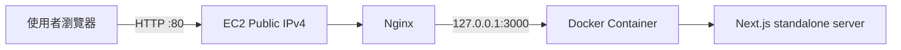

# 台灣 EC2 + Docker + Nginx 前端部署實錄

本文件記錄此專案實際完成的首次 AWS 部署流程：將 Next.js 前端上傳至 AWS 台灣區域的 EC2，在 EC2 建置並執行 Docker container，使用 Nginx 對外代理，最後透過 EC2 Public IPv4 驗證首頁及 SSE 串流。

> 本文件使用 placeholder，不記錄 AWS 帳號、信箱、Instance ID、Security Group ID、PEM 私鑰內容或正式 IP。請勿將 PEM、AWS Access Key、Secret Key 或 Session Token 提交至 Git。

## 1. 已完成的架構



目前資料流：

```text
Browser
  → EC2 Public IPv4:80
  → Nginx
  → 127.0.0.1:3000
  → Next.js Docker container
```

目前未接入 Lambda、Agent API 或 AgentCore；`BACKEND_URL` 未設定時，聊天 API 使用專案內建 mock response。

## 2. 實際環境

| 項目 | 設定 |
|---|---|
| AWS Region | Asia Pacific (Taipei), `ap-east-2` |
| EC2 OS | Ubuntu 26.04 LTS, x86_64 |
| Container runtime | Docker 29.1.3 |
| Reverse proxy | Nginx 1.28.3 |
| Application | Next.js 16.2.10 standalone output |
| Container port | 3000 |
| Host binding | `127.0.0.1:3000:3000` |
| Public listener | Nginx HTTP port 80 |
| Image name | `hoya-bit-frontend:latest` |
| Container name | `hoya-bit-frontend` |
| Restart policy | `unless-stopped` |

## 3. AWS 前置設定

### 3.1 EC2

建立一台台灣區域 EC2：

```text
Name: hoya-bit-frontend
Region: ap-east-2
AMI: Ubuntu Server
Architecture: x86_64
Instance type: 至少約 2 GiB RAM，避免 Next.js build 記憶體不足
Storage: 建議 20 GiB gp3
Auto-assign Public IP: Enabled
```

本次初始 root volume 約 8 GiB，建置完成後使用率已超過 60%。正式使用建議擴充至至少 20 GiB，避免 Docker layers、log 與後續 image 造成磁碟不足。

### 3.2 Key Pair

建立並下載 PEM，例如：

```text
hoya-bit-frontend-key.pem
```

在 macOS 設定權限：

```bash
chmod 400 "$HOME/Downloads/hoya-bit-frontend-key.pem"
```

PEM 只保存在本機安全位置，不可提交 Git 或傳送給其他人。

### 3.3 Security Group

Inbound rules：

| Type | Port | Source | 用途 |
|---|---:|---|---|
| SSH | 22 | My IP | 管理 EC2 |
| HTTP | 80 | `0.0.0.0/0` | 公開前端 |
| HTTPS | 443 | `0.0.0.0/0` | 未來 TLS 使用，可待需要時開啟 |

不要將 SSH port 22 對 `0.0.0.0/0` 開放。

本次曾發生首頁外部連線逾時；原因是 Security Group 尚未開放 HTTP port 80。Nginx 與 container 內部皆正常，新增 inbound HTTP 80 後網站即可開啟。

## 4. SSH 連線

在 macOS Terminal：

```bash
ssh -i "$HOME/Downloads/hoya-bit-frontend-key.pem" \
  ubuntu@<EC2_PUBLIC_IP>
```

第一次連線確認 host fingerprint：

```text
Are you sure you want to continue connecting? yes
```

登入成功後提示符類似：

```text
ubuntu@ip-172-31-x-x:~$
```

## 5. 安裝 Docker、Nginx 與 Git

在 EC2：

```bash
sudo apt-get update
sudo apt-get install -y docker.io nginx git
sudo systemctl enable --now docker
sudo systemctl enable --now nginx
sudo usermod -aG docker ubuntu
```

完整登出並重新登入，讓 Docker group 生效：

```bash
exit
```

重新 SSH 後驗證：

```bash
docker --version
docker ps
sudo systemctl status docker --no-pager
sudo systemctl status nginx --no-pager
```

若仍出現 Docker socket permission denied，可先用 `sudo docker ...` 完成部署，再重新確認 group membership：

```bash
id
getent group docker
ls -l /var/run/docker.sock
```

## 6. 從 macOS 打包原始碼

在本機專案目錄：

```bash
cd /Users/chenweiren/web3-agent-frontend
```

排除不需要上傳的內容：

```bash
tar \
  --exclude='./node_modules' \
  --exclude='./.next' \
  --exclude='./.git' \
  --exclude='./.env' \
  --exclude='./terraform/.terraform' \
  -czf /tmp/hoya-bit-frontend.tar.gz \
  .
```

上傳：

```bash
scp \
  -i "$HOME/Downloads/hoya-bit-frontend-key.pem" \
  /tmp/hoya-bit-frontend.tar.gz \
  ubuntu@<EC2_PUBLIC_IP>:/home/ubuntu/
```

成功時 `scp` 顯示 `100%`。

## 7. 在 EC2 解壓縮原始碼

```bash
mkdir -p /home/ubuntu/web3-agent-frontend

tar -xzf /home/ubuntu/hoya-bit-frontend.tar.gz \
  -C /home/ubuntu/web3-agent-frontend

cd /home/ubuntu/web3-agent-frontend
```

macOS 產生的延伸屬性可能出現以下警告：

```text
tar: Ignoring unknown extended header keyword 'LIBARCHIVE.xattr.com.apple.provenance'
```

這是 metadata 警告，不影響正常檔案。可清除 macOS `._*` sidecar files：

```bash
find /home/ubuntu/web3-agent-frontend \
  -name '._*' \
  -type f \
  -delete
```

確認原始碼：

```bash
ls
```

至少應包含：

```text
Dockerfile
package.json
package-lock.json
app
components
next.config.ts
public
```

## 8. 建置 Docker image

先檢查資源：

```bash
df -h /
free -h
```

建置：

```bash
sudo docker build -t hoya-bit-frontend:latest .
```

本次成功結果：

```text
Next.js production build: success
TypeScript: success
Static pages: generated
Docker image: hoya-bit-frontend:latest
```

確認：

```bash
sudo docker images
```

Legacy builder deprecation 是警告，不影響此次建置；後續可安裝 Docker Buildx 並改用 BuildKit。

### 磁碟不足

若出現：

```text
no space left on device
```

到 AWS Console 擴充 EBS volume，然後依實際 block device 擴充 partition 與 filesystem。先使用以下命令確認裝置名稱，不要直接假設：

```bash
lsblk
findmnt /
```

### 記憶體不足

若 build 被 `Killed`，請擴充 instance RAM 或建立 swap。不要在不確認磁碟空間的情況下直接建立大型 swap。

## 9. 啟動 Docker container

```bash
sudo docker run -d \
  --name hoya-bit-frontend \
  --restart unless-stopped \
  -p 127.0.0.1:3000:3000 \
  hoya-bit-frontend:latest
```

只綁定 `127.0.0.1`，避免直接向 Internet 開放 Next.js port 3000；外部流量統一經過 Nginx。

確認：

```bash
sudo docker ps
sudo docker logs --tail 100 hoya-bit-frontend
curl -I http://127.0.0.1:3000
```

成功指標：

```text
Container status: Up
Next.js: Ready
HTTP/1.1 200 OK
```

## 10. 配置 Nginx

建立設定：

```bash
sudo tee /etc/nginx/sites-available/hoya-bit-frontend >/dev/null <<'EOF'
server {
    listen 80 default_server;
    server_name _;

    location /api/chat/stream {
        proxy_pass http://127.0.0.1:3000;
        proxy_http_version 1.1;

        proxy_set_header Connection "";
        proxy_set_header Host $host;
        proxy_set_header X-Real-IP $remote_addr;
        proxy_set_header X-Forwarded-For $proxy_add_x_forwarded_for;
        proxy_set_header X-Forwarded-Proto $scheme;

        proxy_buffering off;
        proxy_cache off;
        proxy_read_timeout 300s;
        proxy_send_timeout 300s;
        gzip off;
    }

    location / {
        proxy_pass http://127.0.0.1:3000;
        proxy_http_version 1.1;

        proxy_set_header Host $host;
        proxy_set_header X-Real-IP $remote_addr;
        proxy_set_header X-Forwarded-For $proxy_add_x_forwarded_for;
        proxy_set_header X-Forwarded-Proto $scheme;
    }
}
EOF
```

啟用並停用預設站台：

```bash
sudo ln -sf \
  /etc/nginx/sites-available/hoya-bit-frontend \
  /etc/nginx/sites-enabled/hoya-bit-frontend

sudo rm -f /etc/nginx/sites-enabled/default
sudo nginx -t
sudo systemctl reload nginx
```

成功輸出：

```text
syntax is ok
test is successful
```

本機 Nginx 驗證：

```bash
curl -I http://127.0.0.1
```

預期：

```text
HTTP/1.1 200 OK
Server: nginx
```

## 11. 外部驗證

從 macOS：

```bash
curl -I --max-time 15 http://<EC2_PUBLIC_IP>
```

瀏覽器：

```text
http://<EC2_PUBLIC_IP>
http://<EC2_PUBLIC_IP>/chat
```

預期首頁及聊天頁正常載入。

### SSE 驗證

先在 EC2 測 Nginx localhost：

```bash
curl -N --max-time 30 \
  -X POST \
  "http://127.0.0.1/api/chat/stream" \
  -H "Content-Type: application/json" \
  -d '{"message":"測試串流","history":[]}'
```

再從 macOS 測外部 IP：

```bash
curl -N --max-time 30 \
  -X POST \
  "http://<EC2_PUBLIC_IP>/api/chat/stream" \
  -H "Content-Type: application/json" \
  -d '{"message":"測試串流","history":[]}'
```

預期逐段收到：

```text
data: {"delta":"..."}

data: [DONE]
```

如果最後一次才收到全部內容，檢查 Nginx 的 `proxy_buffering off`。

## 12. 常見問題與本次排錯

### Docker daemon：本機 OrbStack socket 不存在

症狀：在 Mac 執行 `docker run` 時出現：

```text
failed to connect to the docker API ... orbstack ... no such file or directory
```

原因：部署 container 的命令應在 EC2 執行，而非未啟動 Docker engine 的 Mac。

### Docker socket permission denied

症狀：

```text
permission denied while trying to connect to /var/run/docker.sock
```

處理：

```bash
sudo usermod -aG docker ubuntu
exit
```

重新 SSH；必要時暫時使用 `sudo docker ...`。

### macOS tar metadata

症狀：大量 `LIBARCHIVE.xattr.com.apple.provenance` 或 `._*`。

影響：不影響原始碼；清除 `._*` 後再 build。

### 外部 `ERR_CONNECTION_TIMED_OUT`

已確認內部 `127.0.0.1:3000` 與 `127.0.0.1:80` 都是 200，但外部 IP timeout。

原因：Security Group 未開 HTTP 80。

解法：新增 inbound HTTP TCP 80，source `0.0.0.0/0`。SSH 22 仍只允許 My IP。

### 從 EC2 呼叫自己的 Public IP 卡住

在 EC2 內測試應優先使用：

```text
http://127.0.0.1:3000
http://127.0.0.1
```

對外路徑應從本機或其他外部網路測試。

## 13. 更新部署

從 macOS重新打包、上傳並解壓後，在 EC2：

```bash
cd /home/ubuntu/web3-agent-frontend
sudo docker build -t hoya-bit-frontend:latest .
sudo docker rm -f hoya-bit-frontend
sudo docker run -d \
  --name hoya-bit-frontend \
  --restart unless-stopped \
  -p 127.0.0.1:3000:3000 \
  hoya-bit-frontend:latest
```

驗證：

```bash
sudo docker ps
sudo docker logs --tail 100 hoya-bit-frontend
curl -I http://127.0.0.1
```

正式部署建議改用 immutable image tag、ECR 及自動化 deployment，而不是長期覆寫 `latest`。

## 14. Elastic IP 的用途

一般 EC2 Public IPv4 在 stop/start 後可能改變。Elastic IP 是可重新關聯的固定公有 IPv4，適合：

- 固定 SSH 目標。
- 固定 DNS A record。
- 避免 EC2 stop/start 後網址改變。

注意：Elastic IP／Public IPv4 可能產生費用；未關聯到運行中資源時仍可能持續計費。建立後必須確認已關聯到正確 EC2。

配置流程：

```text
EC2 Console
→ Network & Security
→ Elastic IP addresses
→ Allocate Elastic IP address
→ 選取新 IP
→ Actions
→ Associate Elastic IP address
→ Resource type: Instance
→ 選擇 hoya-bit-frontend
→ Associate
```

關聯後，原 Public IPv4 可能立即失效。後續 SSH、瀏覽器與 DNS 都要使用新的 Elastic IP：

```bash
ssh -i "$HOME/Downloads/hoya-bit-frontend-key.pem" \
  ubuntu@<ELASTIC_IP>
```

配置後重新驗證：

```bash
curl -I http://<ELASTIC_IP>
```

## 15. 後續正式化項目

- [ ] 擴充 root EBS 至至少 20 GiB。
- [ ] 配置 Elastic IP。
- [ ] 將網域 DNS 指向固定入口。
- [ ] 使用 ACM／ALB 或 Certbot 配置 HTTPS。
- [ ] 將 image 推送至 ECR。
- [ ] 使用 immutable image tag。
- [ ] 將部署改為 ECS／自動化 pipeline（僅在區域與權限支援時）。
- [ ] 接入 Lambda 過濾層與 Agent API。
- [ ] 設定 CloudWatch 或其他 log／monitoring。
- [ ] 檢查 `npm audit` 顯示的 dependency vulnerabilities；不要未評估就執行 `npm audit fix --force`。
- [ ] 設定 log rotation 與 Docker image 清理策略。

## 16. 成功判定

- [x] SSH 可登入 EC2。
- [x] Docker 與 Nginx 已安裝並啟動。
- [x] Next.js image 建置成功。
- [x] Container 使用 restart policy 運行。
- [x] Container `127.0.0.1:3000` 回傳 200。
- [x] Nginx `127.0.0.1:80` 回傳 200。
- [x] Security Group 已開放 HTTP 80。
- [x] 外部瀏覽器可載入前端。
- [ ] Elastic IP 已配置並驗證。
- [ ] HTTPS 已配置。
- [ ] 正式後端／Lambda／Agent 已串接。
